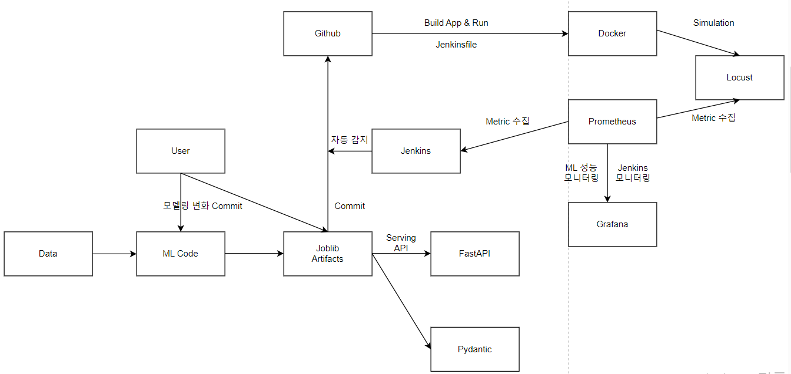

## 분석 주제 및 목표: 지자체 배수지 유출유량 분석을 통한 용수수요 예측 파이프라인 구성


### 핵심 아이디어: 논산배수지의 1주일 전까지의 데이터를 이용해 1주일 전의 데이터를 예측하는 모델을 Docker와 FastAPI를 이용해 Serving하고 Monitoring하는 파이프라인 구축



## 디렉토리 구조

7-reservoir-prediction

- app
    - api.py
    - schemas.py
    - monitoring.py
- artifacts
    - model.joblib
    - scaler.joblib
- docker-compose.yml
- Dockerfile
- requirements.txt
- train.py
- Jenkinsfile

## 1. 데이터 전처리 및 학습

- 훈련 코드 생성(lstm layer 한 개)
    
    [train.py]
    
    전처리 및 표준화
    
    ```python
    train_len = math.ceil(len(target_col_values) * 0.8)  # 29810
        # 8:2로 데이터 분할
        train_df = target_col_values[0:train_len, :]  # 0~29809
        test_df = target_col_values[(train_len-168):, :]  # 24시간 * 7일 
    
        train_min = np.min(train_df)
        train_max = np.max(train_df)
        scaled_train = (train_df-train_min) / (train_max-train_min)  
        scaled_test = (test_df-train_min) / (train_max-train_min)  
    
        # x_train, y_trian - lag 적용
        # append(데이터): list에 데이터를 추가
        x_train = []
        y_train = []
        for i in range(168, train_len):
            x_train.append(scaled_train[(i-168):i, 0])
            y_train.append(scaled_train[i, 0])
        # x_test, y_test - lag 적용
        #len(데이터): 데이터의 길이(데이터프레임은 행의수, 리스트는 데이터의 수)를 출력
        x_test = []
        y_test = scaled_test[168:, :]
        for i in range(168, len(test_df)):
            x_test.append(scaled_test[(i-168):i, 0])
        # array로 변환
    
        # array(): array 데이터를 생성하는 함수
        train_x_array = np.array(x_train)
        train_y_array = np.array(y_train)
        test_x_array = np.array(x_test)
    
        # lstm학습하기 위해 reshape
    
        # reshape(): array의 차원을 변형
        train_x_array = np.reshape(train_x_array, (train_x_array.shape[0], train_x_array.shape[1], 1))  
        test_x_array = np.reshape(test_x_array, (test_x_array.shape[0], test_x_array.shape[1], 1))
    ```
    
    lstm 모델 학습
    
    ```python
    def train():
        logger.info("Preparing dataset...")
        dataset = prepare_dataset()
        y_train=dataset["train_y"]
        x_train=dataset["train_x"]
        y_test=dataset["test_y"]
        x_test=dataset["test_x"]
        train_df=dataset["train_df"]
        test_df=dataset["test_df"]
        data=dataset["data"]
        train_min = np.min(train_df)
        train_max = np.max(train_df)
    
        logger.info("Training model...")
        model_lstm = Sequential()
        model_lstm.add(LSTM(100, return_sequences = False, input_shape = (x_train.shape[1], 1)))  # input_shape = (100,1)  
        model_lstm.add(Dense(25, activation = 'relu'))  # Dense(): 출력 뉴런 수, activation = 'relu': 활성화함수 설정
        model_lstm.add(Dense(1))
        
        model_lstm.compile(optimizer = 'adam', loss = 'mean_squared_error', metrics = ['accuracy']) 
        history = model_lstm.fit(x_train, y_train, batch_size = 16, epochs = 1)
    ```
    
    - 실행해서 artifact에 모델 저장

## FastAPI Serving API 생성

- app 폴더에서 구성
    
    [schemas.py]
    
    - Data Validation 을 위한 [pydantic schema](https://pydantic-docs.helpmanual.io/usage/schema/) 작성
    
    ```python
    from pydantic import BaseModel, Field
    from typing import List, Tuple, Dict, Optional
    
    ## ge : greater than or equal / le : less than or equal
    class Reservoir(BaseModel):
        data: Dict[str, float]
    
    class Flow(BaseModel):
        data: List[float]
    ```
    
- api 생성
    
    [api.py]
    
    - 패키지, model 로드, 기본 api 생성
    
    ```python
    app = FastAPI()
    # scaler = load(ROOT_DIR / "artifacts/scaler.joblib")
    model = load(ROOT_DIR / "artifacts/model.joblib")
    
    @app.post("/predict", response_model=Flow)
    def predict(response: Response, sample: Reservoir):
        prediction_data = model.predict(sample.data)
        prediction = model.predict(reshaped_features)
        response.headers["X-model-score"] = str(prediction_data)
        return Flow(prediction_data)
    ```
    
- Docker-compose 생성
    - docker-compose.yml
        
        ```yaml
        version: "3"
        
        services:
          web:
            build: .
            container_name: js-fastapi-monitoring
            volumes:
              - .:/code
            ports:
              - "5000:80"
        ```
        
    
- 서버에서 실행
    - github repo 생성 후 git remote add origin ~
    - 서버에서 Git Pull
        - `git fetch && git pull origin master`
    - `docker-compose build web`
    - `docker-compose up -d`

- jenkins를 이용한 ml모델 자동 업데이트 및 배포
    - Jenkinsfile 생성
        
        ```yaml
        pipeline {
            agent any
            stages {
                stage("Checkout") {
                    steps {
                        checkout scm
                    }
                }
                stage("Build") {
                    steps {
                        sh 'docker-compose build web'
                    }
                }
                stage("deploy") {
                    steps {
                        sh "docker-compose up -d"
                    }
                }
                stage("Update model") {
                    steps {
                        sh "docker exec -i 7-reservoir-prediction python train.py"
                    }
                }
            }
        }
        ```
        
    - Jenkins 빌드 실행
    - 'GitHub hook trigger for GITScm polling' 선택
    - Github Webhook 설정
        - Github Repository - Settings - Webhooks - Add webhook
    - model 변경하기(lstm layer 추가)
        
        [train.py]
        
        ```python
        model_lstm = Sequential()
        model_lstm.add(LSTM(100, return_sequences = True, input_shape = (train_x_array.shape[1], 1)))  # input_shape = (100,1)  
        model_lstm.add(LSTM(100, return_sequences = False))
        model_lstm.add(Dense(25, activation = 'relu'))  # Dense(): 출력 뉴런 수, activation = 'relu': 활성화함수 설정
        model_lstm.add(Dense(1))
        ```
        
        - jenkins 자동 빌드 및 배포 확인
        - lstm layer가 한 개인 모델과 두 개인 모델의 성능 지표 비교

