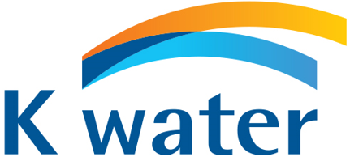

# k-water-mlops

한국수자원공사(k-water)에서 개발한 AI 학습용 예제를 바탕으로 파이프라인을 구성
- 외부 데이터 유입 등으로 측정 데이터 변화 시 변화하는 데이터에 맞춰 주기적으로 알맞은 학습모델 개발 등 지속적 관리 필요
- 클라우드 인프라에서 워크로드를 수행하기 위해
- CI/CD 파이프라인을 통해 통합 및 테스트 단계와 배포 단계에 모니터링 및 자동화를 도입하여 개발 프로세스 개선

## 학습 예제
7. 지자체 배수지 유출유량 분석을 통한 용수수요 예측 파이프라인 구성
    [https://github.com/hyeonseong0917/k-water-mlops/tree/main/10-cctv](https://github.com/hyeonseong0917/k-water-mlops/tree/main/7-reservoir-prediction)https://github.com/hyeonseong0917/k-water-mlops/tree/main/7-reservoir-prediction
